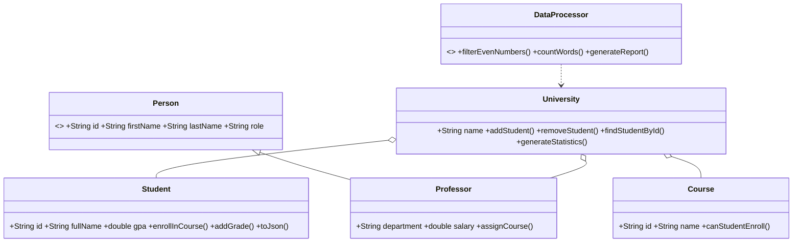

# UML class diagram

```mermaid
classDiagram
  class Person { <<abstract>> +String id +String firstName +String lastName +String role }
  class Professor { +String department +double salary +assignCourse() }
  class Student { +String id +String fullName +double gpa +enrollInCourse() +addGrade() +toJson() }
  class Course { +String id +String name +canStudentEnroll() }
  class University { +String name +addStudent() +removeStudent() +findStudentById() +generateStatistics() }
  class DataProcessor { <<utility>> +filterEvenNumbers() +countWords() +generateReport() }
  Person <|-- Professor
  University o-- Student
  University o-- Professor
  University o-- Course
  DataProcessor ..> University
```
